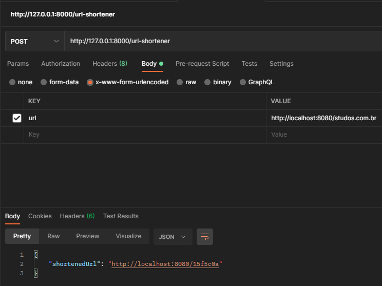
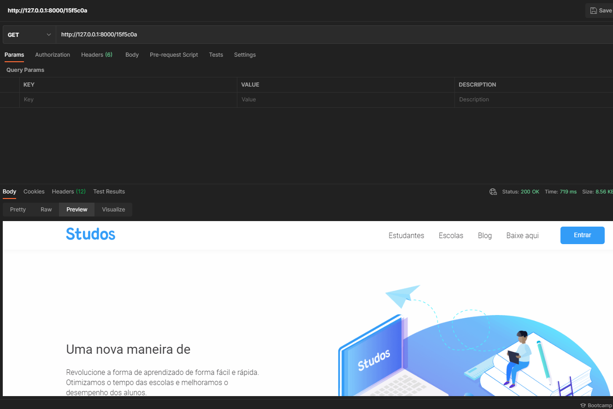

# Url Shortener

## Setup

1 - type git clone git@github.com:PMazzaJ/shortener.git - download the project  
2 - go into project root directory (/shortener)  
3 - type composer install - download project dependencies (download it here :point_right: https://getcomposer.org/download/)  
4 - type php bin/console doctrine:database:create - create MySQL dabatase  
5 - type php bin/console doctrine:migrations:migrate - execute migrations (create tables)  
6 - type symfony server:start | start server @localhost  

## How to use the API:

You can use Postman to try the API! :postbox:     
If you don't have it you can download it here :point_right: https://www.postman.com/downloads/     

1 - make a POST request to http://127.0.0.1:8000/url-shortener sending an URL as a parameter, example:

The api will generate a shortened version of it, having between 5-10 characters and expiring after 1 hour.

2 - make a GET request to http://127.0.0.1:8000/{shortenedUrl}, where {shortenedUrl} is the shortened url that the POST you did before returned to you, example:

if everything goes well you should be redirected to the original URL :metal:
